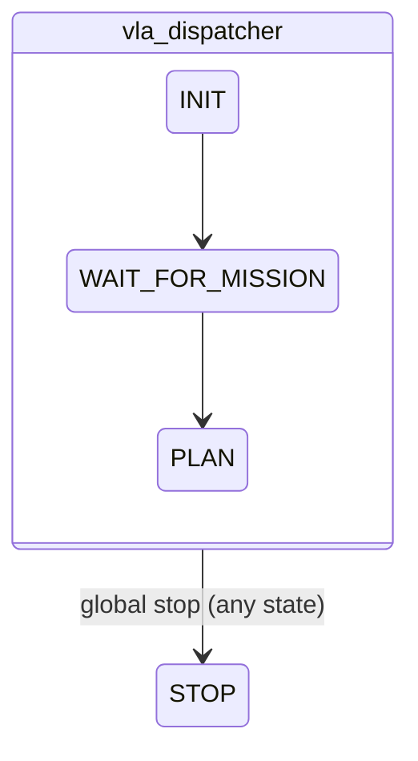
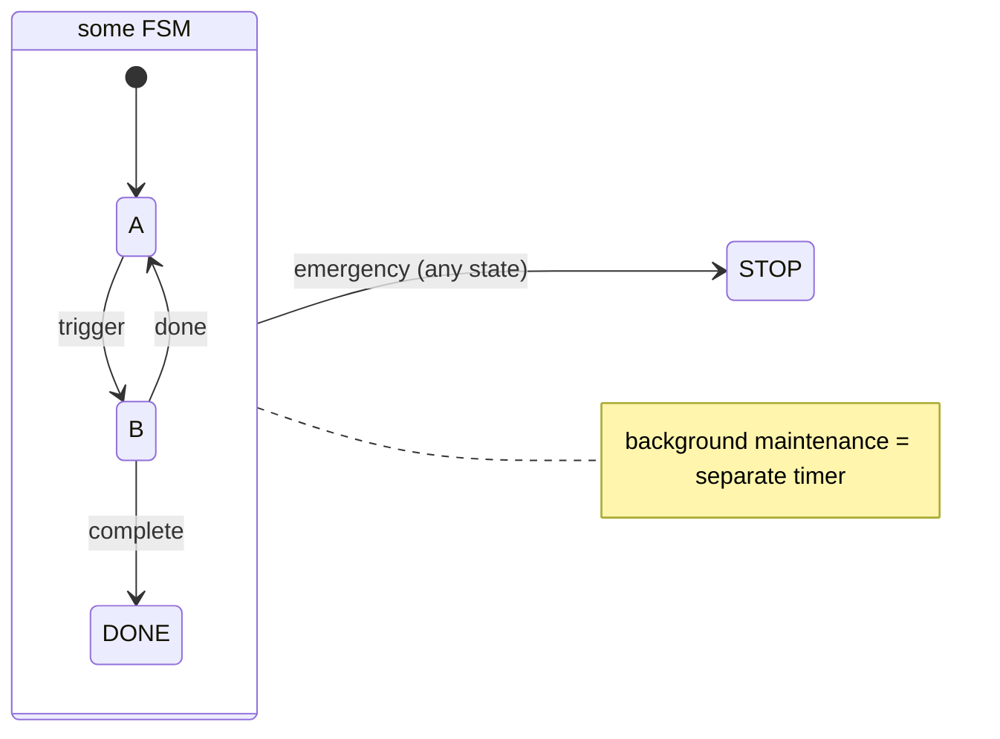

# Mermaid Diagrams

## Golden rule: compile before landing

Every mermaid block you write MUST be validated with `mmdc` (mermaid-cli)
before the edit is considered done. Never trust memory or syntax intuition:

```bash
~/.config/opencode/skills/mermaid/scripts/verify.sh <file.md>
```

Extracts every ` ```mermaid ` block from the markdown file and compiles each
one to SVG. Exit 0 = all blocks valid. If `mmdc` is missing: `npm i -g
@mermaid-js/mermaid-cli`.

## Known pitfalls (real failures, keep adding)

### 1. Composite state referencing its own alias -> cycle error

```mermaid
stateDiagram-v2
    state "vla_dispatcher" as vla {
        INIT --> WAIT_FOR_MISSION
        vla --> STOP   # <-- WRONG: alias inside its own block
    }
```

`mmdc` error: `Setting vla as parent of vla would create a cycle`.

Fix: move the transition OUT of the composite block; referencing the alias
from outside is legal:



Rule: inside `state X { ... }` you may only reference inner state names,
never `X` itself or sibling aliases defined outside the block.

### 2. Aliasing states with labels

State names containing spaces/Chinese MUST use `as` aliasing:
`state "mission_executive (MISSION_FSM_STATE)" as mfsm { ... }`.
Transition labels after `:` are free-form text, safe.

### 3. note placement

`note right of <state>` must sit at block level (outside composite bodies)
and be terminated with `end note`.

### 4. flowchart subgraphs

`subgraph l3["label"] ... end` - quotes around the label are required when it
contains spaces. Edges between subgraph nodes use node names, not subgraph
ids.

## Verified templates

- flowchart LR + subgraph + node labels with `<br/>`: see diag1 in the repo
  READMEs (compiles clean).
- stateDiagram-v2 composite state + external global transition + note:
  structure below always compiles:



## Review checklist

- [ ] Ran `verify.sh` on the file; all blocks compiled
- [ ] No composite state references its own alias
- [ ] Aliased labels use `state "..." as id` form
- [ ] `note ... end note` at block level
- [ ] If a new pitfall was hit: append it to this file in the same session
