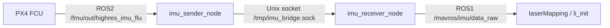
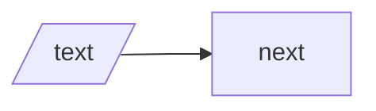

# Writing Mermaid

## Overview

Write Mermaid for the parser first, not for cleverness. Prefer the simplest syntax that survives `mmdc`.

## When to Use

Use this skill when:
- `mmdc` reports parse or lexical errors
- a README diagram renders differently across tools
- labels contain parentheses, slashes, HTML breaks, or command text
- a diagram grows from a simple flowchart into a fragile document block

Do not use this skill when the output is not Mermaid.

## Safe Default

Start from quoted rectangle labels and short edge labels:



Expand only after this renders.

## Core Rules

1. Run `mmdc` after every substantial edit.
2. Default to `A["..."]` for node labels.
3. Rewrite risky text before trying to escape it.
4. Prefer plain rectangles over special shapes.
5. Keep edge labels short and semantic.
6. Summarize shell commands instead of pasting them verbatim.

## Write Labels Safely

- Wrap labels in quotes when they contain parentheses or dense punctuation.
- Use `<br/>` only for real line breaks.
- Rewrite text when punctuation adds no value.


Avoid this:

```mermaid
flowchart LR
    A[Hello (world)] --> B[OK]
```

## Use Special Shapes Carefully

- Close shape delimiters completely.
- Test the shape in isolation before using it in a larger diagram.
- Replace the shape with a rectangle if the parser becomes fragile.

Good:



Bad:

```mermaid
flowchart LR
    A[/text] --> B["next"]
```

## Avoid These Patterns

- Do not paste full shell snippets like `bash -c 'roslaunch ... & sleep 5 && rosrun ...'` into a node.
- Do not combine special shapes, raw parentheses, many `<br/>` tags, and long edge labels in one line.
- Do not debug the full README first. Reproduce the failure in a tiny temp file.

## Debug Parse Errors

1. Copy the failing diagram into `/tmp/test.md`.
2. Reduce it to one failing line.
3. Replace labels with quoted rectangles.
4. Replace special shapes with plain rectangles.
5. Run `mmdc -i /tmp/test.md -o /tmp/test.svg`.
6. Add complexity back one token at a time.

## Quick Reference

| Goal | Prefer | Avoid |
| --- | --- | --- |
| Normal node | `A["text"]` | `A[text with risky punctuation]` |
| Parentheses in label | `A["Hello (world)"]` | `A[Hello (world)]` |
| File or socket shape | `A[/text/]` only if needed | malformed `A[/text]` |
| Long command | summarize the action | paste the whole shell command |
| Verification | run `mmdc` | trust preview alone |

## Bottom Line

Start simple. Quote labels. Prefer rectangles. Verify with `mmdc`. Simplify again as soon as the parser fights back.
